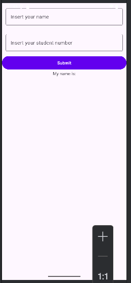

# -IF570-BL-Mobile-Application-Programming---LAB
# -IF570-BL-Mobile-Application-Programming---LAB

This repository contains lab projects for Week 1 of Mobile Application Programming.

## 🚀 How to Run the App
1. Clone this repository:
   ```bash
   git clone https://github.com/Fred-CodeCrafts/-IF570-BL-Mobile-Application-Programming---LAB.git
### 🖼️ Screenshot



## 📂 Available APKs

- **Week 1** → [Download APK](app-debug.apk)  
  *(Student Form App)*  
